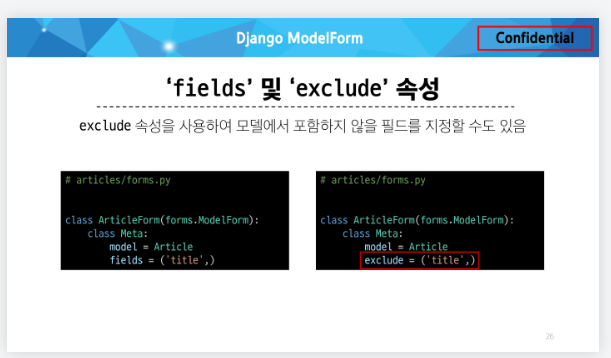

### Django Form

### HTML 'form'
- 지금까지 사용자로부터 데이터를 받기위해 활용한 방법 그러나 비정상적 혹은 악의적인 요청을 필터링 할 수 없음
- > 유효한 데이터인지에 대한 확인이 필요

### Django Form
- 사용자 입력 데이터를 수집하고, 처리 및 유효성 검사를 수행하기 위한 도구
-  > 유효성 검사를 단순화하고 자동화 할 수 있는 기능을 제공
  
### 하나로 묶었을때 태그 거는법
- .as_p : p태그로 묶음
- .as_div : div태그로 묶음
- .as_table
- .as_ul

### Widgets
- HTML 'input' element의 표현을 담당

{{ form.as_p }}
로 작성하였을 시
forms.py에서 css를 적용시켜야함

### fields 및 exclude 속성
-  exclude 속성을 사용하여 모델에서 포함하지 않은 필드를 지정할 수도 있음
-  
  

### is_valid()
- 여러 유효성 검사를 실행하고, 데이터가 유효한지 여부를 Boolean으로 반환

### new & create view 함수간 공통점과 차이점
- 공통점 : 데이터 생성을 구현하기 위함
- 차이점 : new는 GET method 요청만을, craete는 POST method 요청만을 처리
