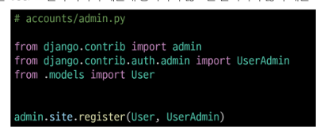

### Django-authentication system 1

# 장고 인증 시스템

### HTTP 특징
- 비 연결 지향
- 서버는 요청에 대한 응답을 보낸 후 연결을 끊음

- 무상태
- 연결을 끊는 순간 클라이언트와 서버 간의 통신이 끝나며 상태 정보가 유지되지 않음

### 상태가 없다는 것은...
- 장바구니에 담은 상품을 유지할 수 없음
- 로그인 상태를 유지할 수 없음

### 쿠키
- 서버가 사용자의 웹 브라우저에 전송하는 작은 데이터 조각
- > 클라이언트 측에서 저장되는 작은 데이터 파일이며, 사용자 인증,추적,상태 유지 등에 사용되는 데이터 저장 방식

#### 쿠키 사용 원리
- 브라우저는 쿠키를 KEY - VALUE의 데이터 형식으로 저장
- 이렇게 쿠키를 저장해 놓았다가, 동일한 서버에 재요청 시 저장된 쿠키를 함께 전송
- 쿠키는 두 요청이 동일한 브라우저에서 들어왔는지 아닌지를 판단할 때 주로 사용됨
  - 이를 이용해 사용자의 로그인 상태를 유지할 수 있음
  - 상태가 없는(stateless) HTTP 프로토콜에서 상태 정보를 기억 시켜 주기 때문

#### 세션 작동 원리
- 클라이언트가 로그인을 하면 서버가 session 데이터를 생성 후 저장
- 생성된 session 데이터에 인증 할 수 있는 session id를 발급
- 발급한 session id를 클라이언트에게 응답
- 클라이언트는 응답 받은 session id를 쿠키에 저장
- 클라이언트가 다시 동일한 서버에 접속하면 요청과 함께 쿠키(session id가 저장된)를 서버에 전달
- 쿠키는 요청 때마다 서버에 함께 전송 되므로 서버에서 session id를 확인해 로그인 되어있다는 것을 알도록 함

### 쿠키 종류별 Lifetime (수명)
1. Session cookie 
    - 현재 세션이 종료되면 삭제됨
    - 브라우저 종료와 함께 세션이 삭제됨
2. Persistend cookies
    - Expires속성에 지정된 날짜 혹은 Max-Age 속성에 저장된 기간이 지나면 삭제됨

### 사전 준비
- 두 번째 app accounts 생성 및 등록
- django 내부적으로 accounts라는 이름으로 사용하고 있기 때문에 되도록 'accounts'로 지정하는 것을 권장

### Custom User model로 '대체'하기

- 대체하기(1/3)
- 
- 대체하기(2/3)
- 
- 대체하기(3/3)
- 

- 프로젝트 중간에 AUTH_USER_MODEL을 변경 할 수 없음
- 이미 프로젝트가 진행되고 있을 경우 데이터베이스 초기화 후 진행
### 첫 migrate 전에 진행 해줘야 됨 !!!!!

### DB 초기화
- db 파일 지우고 migrate에 번호 붙은거 지우면 됨

### Login
- session을 create하는 과정

### Logout
- 현재 요청에 대한 Session Data를 DB에서 삭제
- 클라이언트 쿠키에서도 Session id를 삭제

### 템플릿과 인증 데이터

